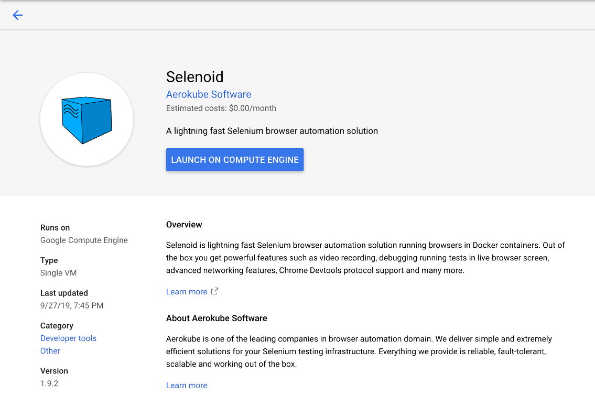
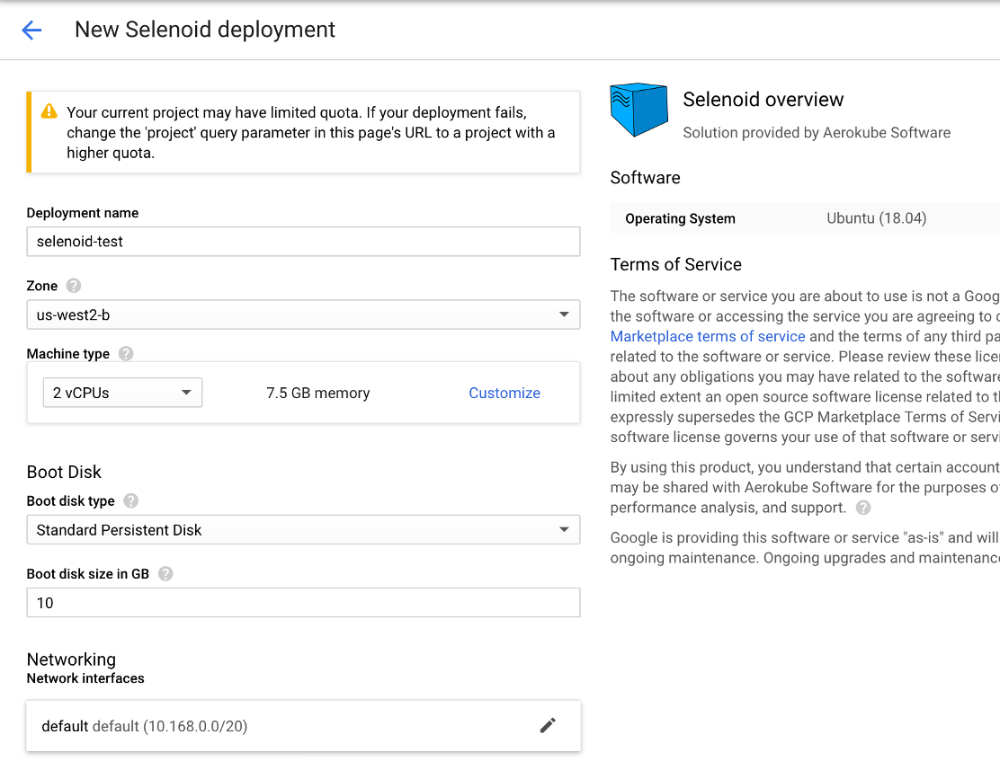
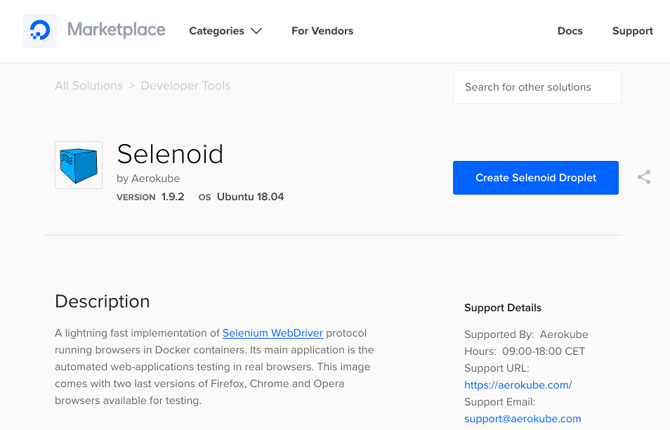
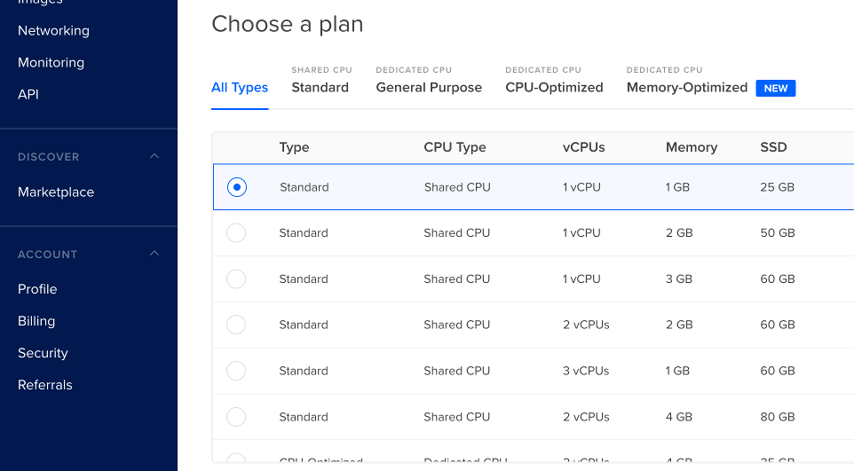
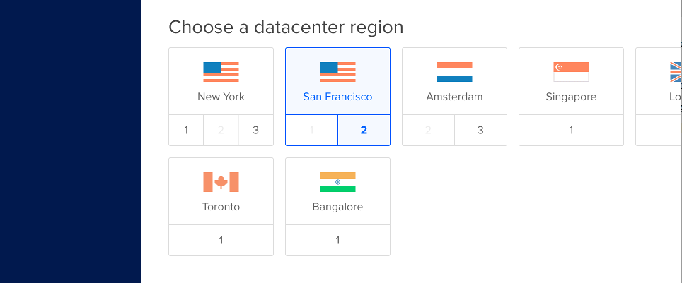
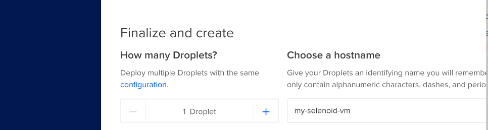
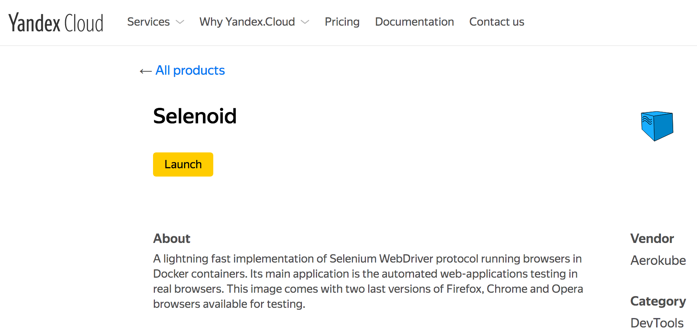
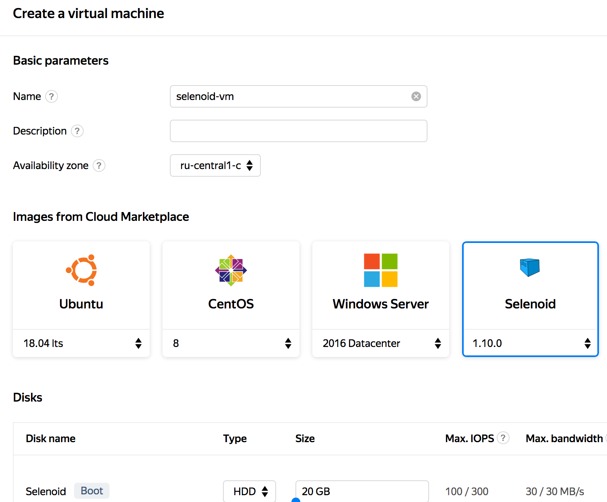

== Cloud Platforms

Selenoid ready-to-use images are present in popular cloud platforms and can be run in a few clicks. This section contains step-by-step instructions on launching Selenoid in these platforms.

=== Google Cloud

Selenoid can be run from https://console.cloud.google.com/marketplace[Google Cloud Marketplace] as follows:

. Go to https://console.cloud.google.com/marketplace/details/aerokube/selenoid[Selenoid page] and click the **Launch on Compute Engine** button:
+

. Type virtual machine name, size and click the **Deploy** button:
+

. Wait for virtual machine to start. Selenoid user interface is available at `http://<vm-ip-address>:8080/`. Selenium tests should be run against `http://<vm-ip-address>:4444/wd/hub`.

=== DigitalOcean

Selenoid can be run from https://marketplace.digitalocean.com/[DigitalOcean Marketplace] as follows:

. Go to https://marketplace.digitalocean.com/apps/selenoid[Selenoid page]:
+

. Click on **Create Selenoid Droplet** button.
. Choose a plan, i.e. virtual machine size:
+

. Choose a data center region near you:
+

. Select or add an SSH key for your droplet.
. Select a name for your virtual machine:
+

. Click on **Create Droplet** button.
. Wait for virtual machine to start. Selenoid user interface is available at `http://<vm-ip-address>:8080/`. Selenium tests should be run against `http://<vm-ip-address>:4444/wd/hub`.

=== Yandex Cloud

Selenoid can be run from https://cloud.yandex.com/marketplace[Yandex Cloud Marketplace] as follows:

. Go to https://cloud.yandex.com/marketplace/products/f2e1m50sdg87g8eh716h[Selenoid page] and click the **Launch** button:
+

. Type virtual machine name, select disk size, available computing resources and click the **Create VM** button:
+

. Wait for virtual machine to start. Selenoid user interface is available at `http://<vm-ip-address>:8080/`. Selenium tests should be run against `http://<vm-ip-address>:4444/wd/hub`.
